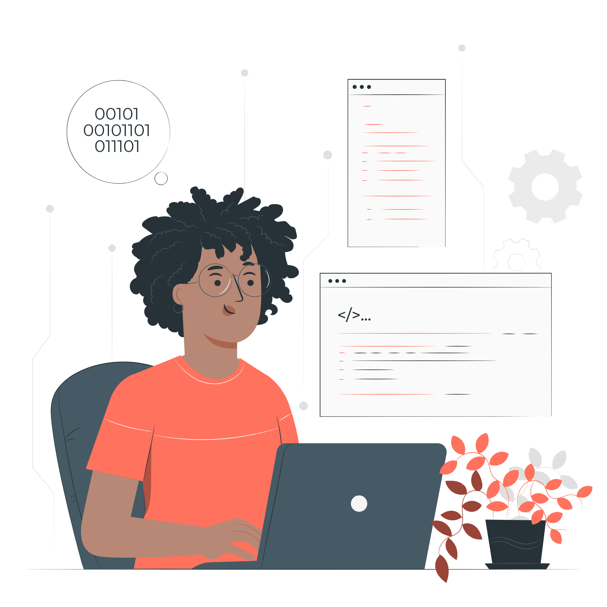
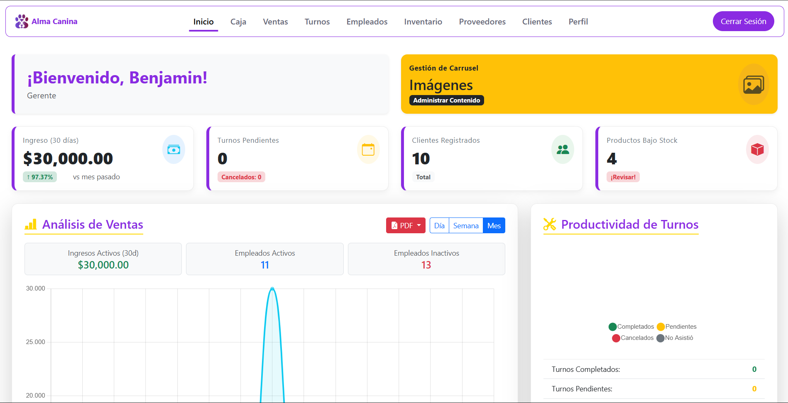

  

<h1 align="center">
Hola soy Benjamin Villanueva 

</h1>

  
  
  
  

<h2><b></b> Sobre mí</h2>

Soy Técnico en Análisis de Sistemas con interés en desarrollo web y backend.
Me gusta aprender nuevas tecnologías y desarrollar proyectos que mejoren mis habilidades como programador.

<h2> Proyectos</h2>

  <table align="center">
    <tr>
      <td align="center">
        
         
        
Almacanina

        

          
        

      </td>
      <td align="center" valign="top"> 
        
         
        
Alma canina mobile

        

          
        

      </td>
      <td align="center">
        
         
        
portfolio

        

          
        

      </td>
    </tr>
  </table>

<h2>Habilidades</h2>
<h3 align="center">Lenguajes</h3>

  
  &nbsp;&nbsp;&nbsp;&nbsp; 
  &nbsp;&nbsp;&nbsp;&nbsp;
  
  &nbsp;&nbsp;&nbsp;&nbsp;
  

<h3 align="center">Frameworks</h3>

  
  &nbsp;&nbsp;&nbsp;&nbsp;
  
  &nbsp;&nbsp;&nbsp;&nbsp;
  
  &nbsp;&nbsp;&nbsp;&nbsp;
  
  &nbsp;&nbsp;&nbsp;&nbsp;
  

<h3 align="center">Base de datos</h3>

  
  &nbsp;&nbsp;&nbsp;&nbsp;
  
  &nbsp;&nbsp;&nbsp;&nbsp;
  

<h3 align="center">Herramientas</h3>

  
  &nbsp;&nbsp;&nbsp;&nbsp;
  
  &nbsp;&nbsp;&nbsp;&nbsp;
    
    &nbsp;&nbsp;&nbsp;&nbsp;
  

<h2>Estadisticas</h2>

<picture>
  <source
    srcset="https://github-readme-stats.vercel.app/api?username=anuraghazra&show_icons=true&theme=dark"
    media="(prefers-color-scheme: dark)"
  />
  <source
    srcset="https://github-readme-stats.vercel.app/api?username=anuraghazra&show_icons=true"
    media="(prefers-color-scheme: light), (prefers-color-scheme: no-preference)"
  />
  
</picture>
 

  

